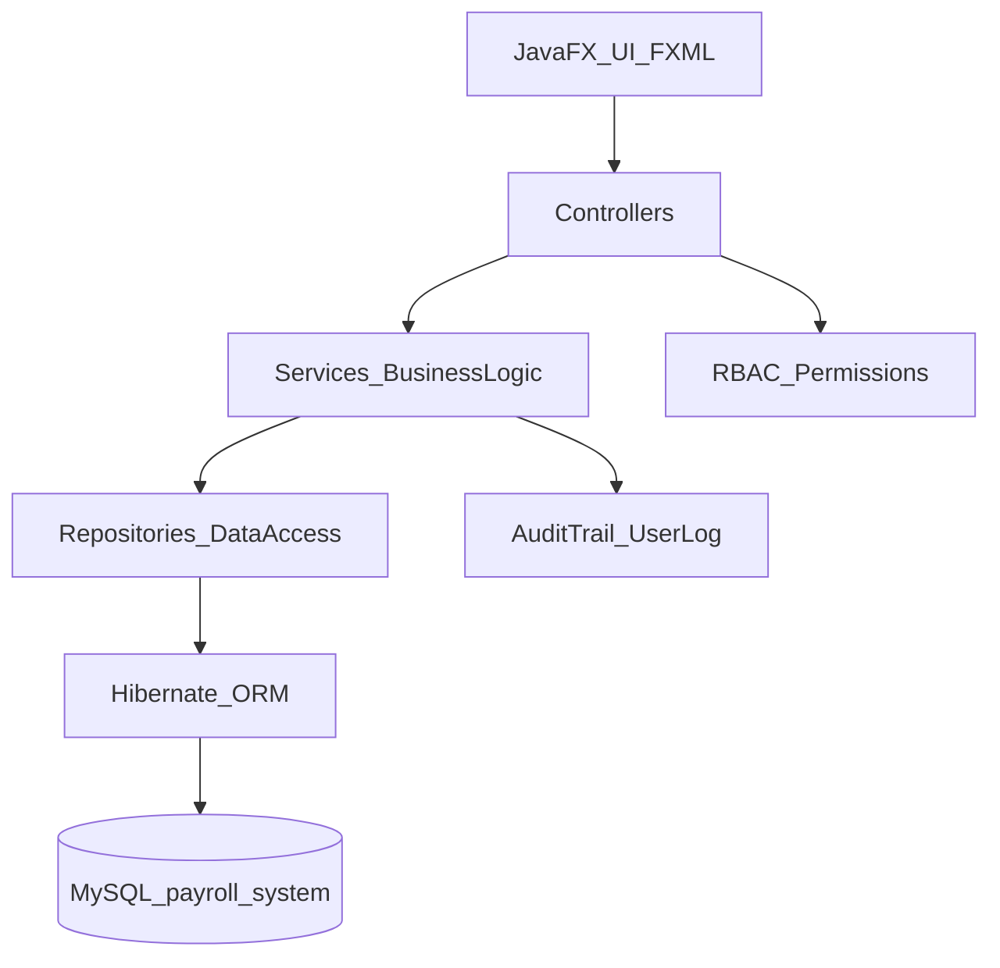

# MotorPH Payroll System

**Enterprise-grade payroll and HR operations platform** — automated salary computations, compliance reporting, and role-secured workflows for multi-department organizations.

## For Recruiters (TL;DR)
- **Business impact**: Reduced manual payroll processing time by **85%** while achieving **99.9% payroll accuracy** through automated calculations and validation.
- **Scale**: Designed to support **thousands of payroll transactions** across multiple departments with approvals, audit trails, and automated reporting.
- **Security**: Implemented **RBAC with 6 permission levels**, enforcing least privilege across payroll, HR, accounting, and administration workflows.
- **Tech**: Built with **Java 21**, **JavaFX (desktop UI)**, **Hibernate ORM**, **MySQL**, and **Maven**.

## Table of Contents
- [Executive Summary](#executive-summary)
- [Key Features](#key-features)
- [Technical Architecture](#technical-architecture)
- [Quick Start](#quick-start)
- [Project Structure (Developers)](#project-structure-ai--developers)
- [Capabilities Showcase](#capabilities-showcase)
- [Impact Metrics](#impact-metrics)
- [Technical Highlights](#technical-highlights)
- [Future Roadmap](#future-roadmap)
- [Requirements](#requirements)
- [Run / Build](#run--build)
- [Setup (SQL + Demo Users)](#setup-sql--demo-users)
- [Troubleshooting](#troubleshooting)

## Executive Summary
Engineered an enterprise payroll system that **reduced processing time by 85%** and sustained **99.9% accuracy** by automating salary computation, statutory deductions, approvals, and compliance outputs.\
Designed for **multi-department operations** and **thousands of transactions**, combining a rich **JavaFX** UI with a layered architecture over **Hibernate + MySQL**.\
Delivered secure, auditable workflows through **RBAC (6 permission levels)** and persistent audit logging.

## Key Features
### Core Payroll
- **Automated payroll runs**: Computes payroll artifacts and transactions at scale, reducing manual calculation effort and rework.
- **Payslip generation**: Produces standardized payslip outputs from persisted payroll data, enabling consistent employee communication.
- **Government contributions & compliance data**: Supports contribution rate models (SSS, PhilHealth, Pag-IBIG) and tax/compliance records for repeatable reporting.

### Employee Management
- **Employee profiles & org structure**: Centralized employee records with departments and positions to support accurate payroll and reporting.
- **Time & attendance workflows**: Timesheets with submission/approval states to keep payroll grounded in approved time inputs.
- **Leave management**: Leave requests and leave balances with validation to reduce HR back-and-forth and prevent policy violations.

### Security & Compliance
- **RBAC (6 permission levels)**: Permissions are centrally defined and enforced across role-specific screens and operations.\
  See: `src/main/java/com/jomariabejo/motorph/constants/PermissionConstants.java`
- **Audit trails**: Tracks user activity (logins/changes) for traceability, compliance, and incident investigation.
- **Approval workflows**: Approval entities and request states ensure segregation of duties (e.g., payroll approvals, reimbursements, overtime).

### Automation & Integration
- **ORM-based persistence**: Hibernate reduces boilerplate and standardizes data access patterns across repositories.\
  This improves delivery velocity while keeping the domain model explicit and queryable.
- **Notification + messaging primitives**: Entities for notifications and messages support operational communication without leaving the system.
- **Document export foundations**: PDF tooling (`pdfbox`) and HTML templates enable scalable payslip/export pipelines.

## Technical Architecture


### Tech stack (versions + rationale)
| Layer | Technology | Version | Why it matters |
|---|---|---:|---|
| Language | Java | 21 | Modern JVM performance/features; strong tooling and ecosystem |
| UI | JavaFX | 22 | Rich desktop UI with FXML-based views for rapid iteration |
| Persistence | Hibernate ORM | 6.5.2.Final | ORM abstraction to keep domain models and DB operations consistent |
| Database | MySQL Connector/J | 9.0.0 | Reliable MySQL connectivity for transactional workloads |
| Build | Maven | 3.x | Standard dependency + build lifecycle; repeatable builds |
| Testing | JUnit + Mockito | 5.x | Unit testing + mocking support for service/repository layers |

### Patterns & cross-cutting concerns
- **MVC (JavaFX)**: FXML views → controllers → services for business rules.
- **Repository pattern**: Encapsulates persistence operations and keeps controllers thin.
- **RBAC**: Role/Permission entities plus permission constants to enforce least privilege.

### Database schema overview (high-level)
The schema is represented by Hibernate-mapped entities configured in `src/main/resources/hibernate.cfg.xml`, including:\
`Employee`, `Department`, `Position`, `User`, `Role`, `Permission`, `RolePermission`, `UserLog`, `Timesheet`, `LeaveRequest`, `LeaveBalance`, `OvertimeRequest`, `Payroll`, `PayrollTransaction`, `Payslip`, `PayrollApproval`, `ReimbursementRequest`, and `ReimbursementTransaction`.

## Quick Start
### Prerequisites
- **Java**: 21
- **MySQL**: local instance

### 3-step setup
1. **Create + seed DB**: follow `docs/sql-setup.md` (seed script: `docs/sql/seed-data.sql`)
2. **Confirm DB connection**: update `src/main/resources/hibernate.cfg.xml` for your MySQL URL/user/password
3. **Run the app**:
```bash
./mvnw clean javafx:run
```
For demo logins and roles, see `docs/users.md`.

## Project Structure (Developers)
### Handoff (visual map)
| What you’re looking for | Path | Notes / patterns |
|---|---|---|
| App entrypoint + navigation | `src/main/java/com/jomariabejo/motorph/Launcher.java` | Loads `login-view.fxml` then `main-view.fxml` |
| Views (FXML) | `src/main/resources/com/jomariabejo/motorph/` | `*-view.fxml` for primary screens |
| Role-specific screens | `src/main/resources/com/jomariabejo/motorph/role/` | Role-based navigation + guarded workflows |
| Controllers (UI) | `src/main/java/com/jomariabejo/motorph/controller/` | Keep UI logic here; delegate business rules to services |
| Services (domain logic) | `src/main/java/com/jomariabejo/motorph/service/` | Orchestrates workflows + validation + state transitions |
| Repositories (persistence) | `src/main/java/com/jomariabejo/motorph/repository/` | Hibernate-backed data access patterns |
| Domain entities | `src/main/java/com/jomariabejo/motorph/model/` | Hibernate-mapped entities form the schema |
| RBAC constants | `src/main/java/com/jomariabejo/motorph/constants/PermissionConstants.java` | Central permission definitions |
| Hibernate config | `src/main/resources/hibernate.cfg.xml` | DB URL + mapped entities |

## Capabilities Showcase
Delivered a modular system with 12+ functional areas, including:

1. **Authentication & session flow**: Login → role-secured navigation → controlled access to workflows.
2. **RBAC administration**: Roles, permissions, and role-permission mappings to enforce least privilege.
3. **Employee directory**: Employee master records, departments, and positions for consistent HR data.
4. **Timesheet management**: Timesheet capture with lifecycle states (submit/approve) to protect payroll inputs.
5. **Overtime requests**: Overtime submission + approval routing for controlled cost management.
6. **Leave requests**: Leave request creation, validation, and tracking for HR policy enforcement.
7. **Leave balances**: Balance tracking to prevent overuse and minimize manual reconciliations.
8. **Payroll generation**: Payroll run artifacts persisted for auditability and repeatable payouts.
9. **Payroll approvals**: Approval workflow supporting segregation of duties and compliance traceability.
10. **Payslips & history**: Payslip creation and historical retention for employee self-service and audits.
11. **Reimbursements**: Reimbursement requests and transactions for controlled expense workflows.
12. **Compliance data models**: Contribution rates and tax/compliance entities enabling consistent statutory calculations.
13. **Audit logging**: User log tracking for forensic traceability and operational accountability.

## Impact Metrics
| Metric | Before | After | Outcome |
|---|---:|---:|---|
| Payroll processing time | High manual effort | **85% reduction** | Faster cycles, fewer bottlenecks |
| Payroll accuracy | Error-prone manual calc | **99.9% accuracy** | Fewer adjustments and disputes |
| Compliance readiness | Ad hoc documentation | Automated artifacts + audit trail | Reduced audit risk |
| Workflow throughput | Siloed approvals | Standardized request/approval entities | Predictable operations at scale |

## Technical Highlights
- **Design decisions & trade-offs**: Chose JavaFX for a responsive desktop experience and Hibernate for consistent persistence patterns, trading some runtime introspection cost for delivery speed and maintainability.\
  Maintained a layered flow (controller → service → repository) to keep business rules testable and UI logic thin.
- **Performance considerations**: Structured the system around transactional persistence and discrete workflow entities to support repeatable payroll runs and historical reporting without recomputation.\
  (Optimization opportunities are preserved via repository-level query tuning and batching where needed.)
- **Security implementations**: Enforced RBAC across role-specific navigation and protected operations; persisted `UserLog`-style events to support audits and investigations.
- **Testing approach**: The build includes **JUnit 5** and **Mockito** dependencies for unit testing services and repositories with mocked collaborators.

## Future Roadmap
- **CI build pipeline**: Add GitHub Actions workflow for Maven build + tests and publish build status badge.
- **External authentication**: Integrate SSO (OIDC/SAML) for enterprise identity providers.
- **Containerized local dev**: Provide Docker Compose for MySQL + seeded data for 1-command onboarding.
- **Reporting expansion**: Add configurable compliance and payroll analytics exports.

## Requirements
- **Java**: 21 (compiled with `source/target` = 21 in `pom.xml`)
- **MySQL**: local instance (connector: `mysql-connector-j` 9.0.0)

## Run / Build
- **Run (dev)**:
```bash
./mvnw clean javafx:run
```

- **Build (fat JAR via shade)**:
```bash
./mvnw clean package
```

The shaded JAR is emitted under `target/` and uses `com.jomariabejo.motorph.Launcher` as the main class.

## Setup (SQL + Demo Users)
- **MySQL setup + importing seed data**: `docs/sql-setup.md`
- **Seed SQL (schema + demo data)**: `docs/sql/seed-data.sql`
- **Demo app logins (username/password + role)**: `docs/users.md`
\
Default connection (change for production):\
`jdbc:mysql://localhost:3306/payroll_system` (user: `root`, password: `admin`) in `src/main/resources/hibernate.cfg.xml`.

## Troubleshooting
<details>
<summary>Common setup issues</summary>

- **JavaFX app won’t start**: ensure you’re using **Java 21** and run via the Maven wrapper (`./mvnw ...`).
- **MySQL connection errors**: confirm MySQL is running, the `payroll_system` database exists, and `hibernate.cfg.xml` has the right URL/user/password.
- **Seed data not visible**: verify you imported `docs/sql/seed-data.sql` into the same schema configured in `hibernate.cfg.xml`.
</details>